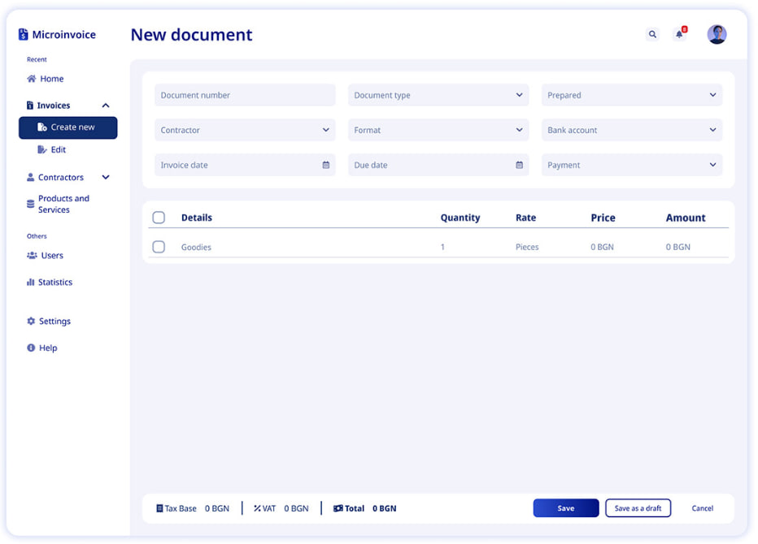
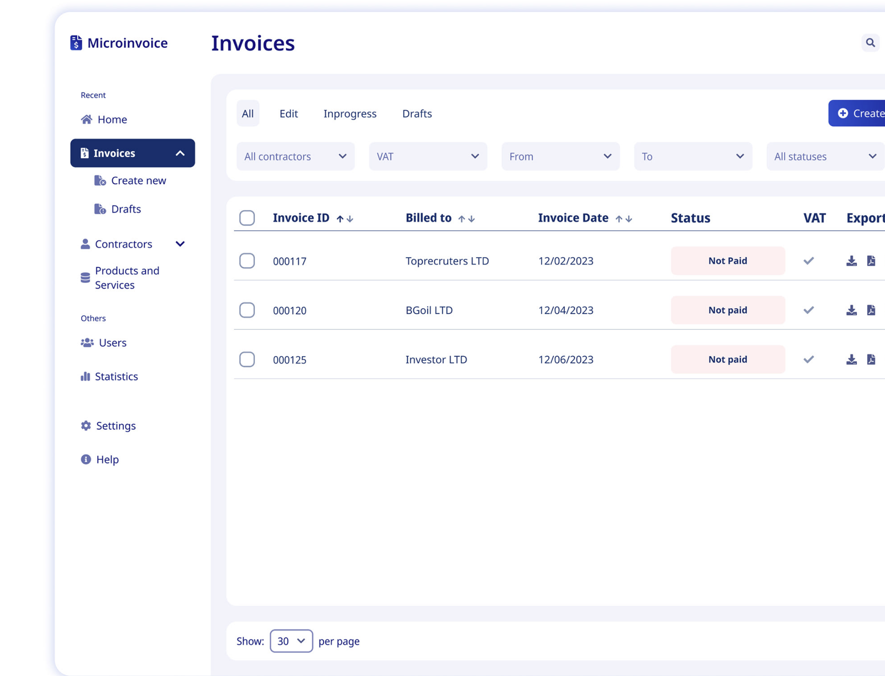

# The Frontend Homework

As part of our application process, we'd like to see what you can produce by giving you a small assignment. It should take you no more than a few hours to complete the assignment, but any extra polish or features you might want to put in will not go unnoticed.

## The assignment

We would like you to create an invoicing app. The features it should include:

 - [ ] Create a new invoice
 - [ ] Add line items to the invoice. 
   Line items may item name, quantity, unit, unit price, calculated price, etc.
 - [ ] Add notes to the invoice, including possibly how to pay it, where to send checks, etc.
 - [ ] Send the invoice via email (does not have to actually send emails, but if it does, great!)
 - [ ] View invoices including status (paid, outstanding, late, etc.)

Your backend can be anything, and does not have to work. If you would like to use a mocked-out interface, that is fine (even static data in code is ok).

You can use design materials from this source: [Behance](https://www.behance.net/gallery/190762531/Microinvoice-UIUX-Case-Study)

#### Extra credit features

 - [ ] Add a due date to an invoice
 - [ ] View late invoices, or even better, alert when an invoice is late
-  [ ] Add filters for listing page
 - [ ] Polish and UX
 - [ ] Highly reusable components
 - [ ] Tests

## Requirements

You can use any tools at your choice to accomplish this task.

- ReactJS framework
- ES6/7 Syntax - you pick the stages

or anything else that seems the best familiar with you

If you have any questions, please ask!

To complete your homework, please fork this repo and commit your work to your fork. When you are ready for us to look at it, give us access to your fork so we can review and run it.

Timeline estimation: 7 days.
